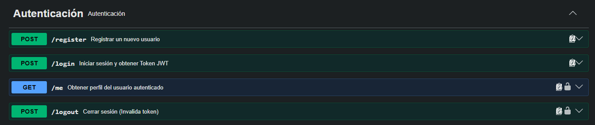
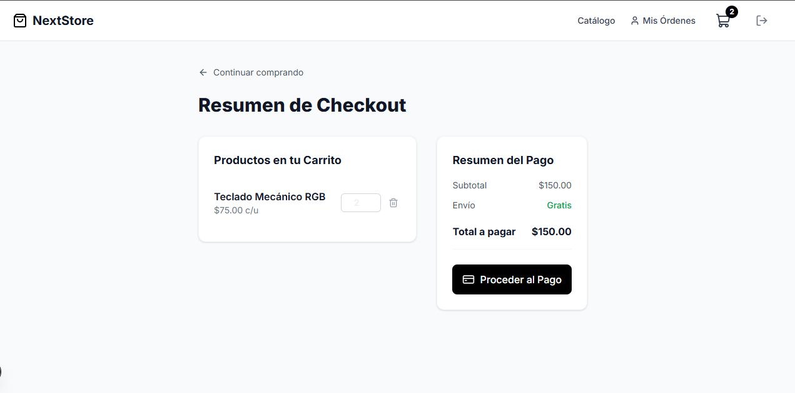
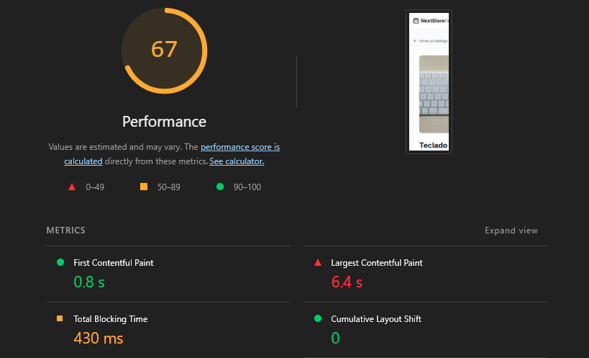

# NextStore - Frontend E-commerce en Next.js (App Router)

Aplicación frontend moderna desarrollada en **Next.js 16+ (App Router)** con **TypeScript** y **Tailwind CSS**, consumiendo una API REST de e-commerce construida en Laravel 12 con autenticación por cookies `httpOnly`, mutaciones asíncronas vía Server Actions, integración de pagos con Stripe y optimización de métricas **Web Vitals**.

---

## Stack Tecnológico

- **Framework:** Next.js 16+ (App Router, Streaming SSR)
- **Lenguaje:** TypeScript
- **Estilos:** Tailwind CSS
- **Autenticación:** Server Actions + Cookies `httpOnly`
- **Pasarela de Pago:** Stripe Elements (`@stripe/stripe-js`)
- **Iconos:** `lucide-react`

---

## Configuración de Entorno

Crea un archivo `.env.local` en la raíz del proyecto basándote en `.env.example`:

```env
NEXT_PUBLIC_API_BASE_URL=http://localhost:8000/api
NEXT_PUBLIC_STRIPE_PUBLISHABLE_KEY=pk_test_tu_llave_publica_de_stripe
```

---

## Pasos para Ejecutar el Proyecto

1. **Instalar dependencias:**

   ```bash
   npm install
   ```

2. **Ejecutar servidor de desarrollo:**

   ```bash
   npm run dev
   ```

3. **Compilar para producción y verificar Web Vitals:**
   ```bash
   npm run build
   npm run start
   ```

---

## Rutas Implementadas

| Ruta                     | Descripción                                 | Tipo                    | Protegida |
| :----------------------- | :------------------------------------------ | :---------------------- | :-------: |
| `/catalogo`              | Listado público de productos                | Server Component        |    No     |
| `/catalogo/[id]`         | Detalle de producto con metadatos dinámicos | Server Component        |    No     |
| `/login`                 | Formulario de autenticación                 | Client Component        |    No     |
| `/registro`              | Formulario de registro                      | Client Component        |    No     |
| `/checkout`              | Carrito y flujo de pago con Stripe          | Client + Server Actions |    Sí     |
| `/checkout/confirmacion` | Confirmación de compra realizada            | Server Component        |    Sí     |
| `/ordenes`               | Historial de compras del usuario            | Server Component        |    Sí     |

---

## Requisitos de Rendimiento y Resiliencia

- **Carga progresiva:** Implementación de `loading.tsx` con Skeletons en `/catalogo` y `/checkout`.
- **Manejo de errores:** Captura de excepciones del segmento mediante `error.tsx` interactivo.
- **Mutaciones y consistencia:** Revalidación inmediata de caché mediante `revalidatePath('/ordenes')` y `revalidateTag('historial-ordenes')`.
- **Web Vitals:** Optimización LCP mediante Next `Image`, fuentes optimizadas con `next/font` y renderizado del lado del servidor.

---

## Evidencias del Proyecto

### 1. Documentación de la API (Swagger / OpenAPI)

Visualización interactiva de los endpoints de Laravel 12 consumidos desde Next.js (`/login`, `/register`, `/products`, `/orders`).



---

### 2. Flujo Completo de Compra (E-commerce)

Evidencia del flujo funcional que abarca la navegación del catálogo, carrito de compras, integración del checkout y confirmación de la orden.



---

### 3. Reporte de Rendimiento y Web Vitals (Lighthouse)

Resultados de la auditoría de rendimiento obtenida en la build optimizada de producción de Next.js.


